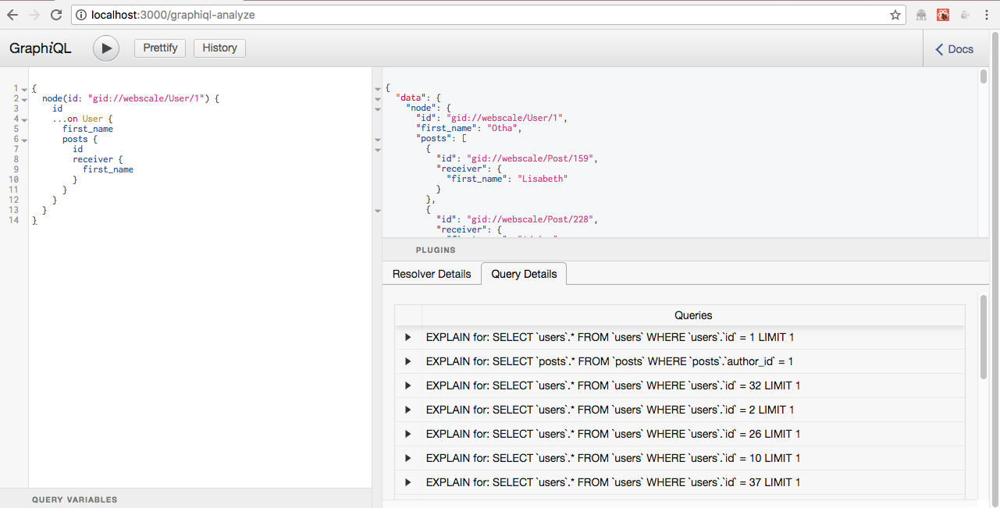

# Webscale

[](https://travis-ci.org/GraphQL-Query-Planner/webscale)

A web app used for demonstrating [graphql-analyzer](https://github.com/GraphQL-Query-Planner/graphql-analyzer)

## Requirements

[Install Ruby on Rails 5.1](http://railsapps.github.io/installrubyonrails-mac.html)

This project assumes the following tools and their respective versions are installed:
* chruby: v0.3.9
* ruby-install: v0.6.1
* Ruby: v2.4.1
* RubyGems: v2.6.12
* Rails: v5.1
* MySQL: v5.7.19


## Getting Started

Clone this repository.

```
$ git clone https://github.com/GraphQL-Query-Planner/project.git
```

Install depenedcies.

```
$ bundle install
```

Setup the database, and seed it with fake data.
```
$ rake db:setup
```

Start your rails server.

```
$ rails server
```

Visit `http://localhost:3000/graphiql-analyze`.

Run a query and view the plugins tabs!



### MySQL Setup

Webscale is configured to use MySQL as it's database. In macOS, MySQL can be installed using brew:

```bash
$ brew install mysql
```

By default the mysql user is root with no password.

Once installed, you can now start `MySQL`:
```bash
$ brew services start mysql
```

Once installed, verify your environments connection to the database by creating the databases:

```bash
$ rake db:create
Created database 'webscale_dev'
Created database 'webscale_test'
```

### ElasticSearch Setup

Webscale uses ElasticSearch for searching and aggregating data. In macOS, ElasticSearch can be installed using brew:

```bash
brew install elasticsearch
```

Once installed, you can now start `ElasticSearch`:
Â
```bash
brew services start elasticsearch
```

#### Import your data models

```bash
bundle exec rake environment elasticsearch:import:model CLASS='Comment' FORCE=y
bundle exec rake environment elasticsearch:import:model CLASS='Post' FORCE=y
```
